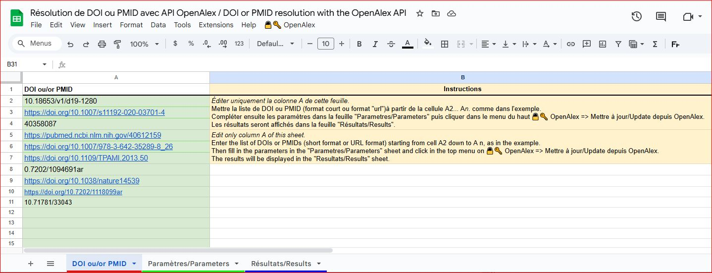
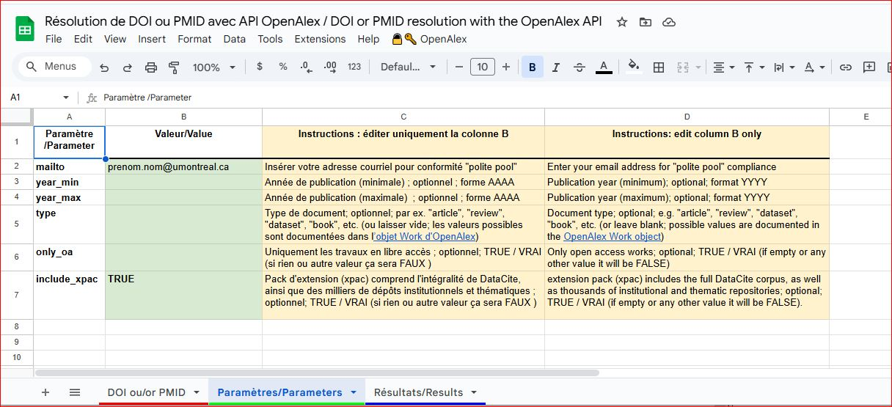
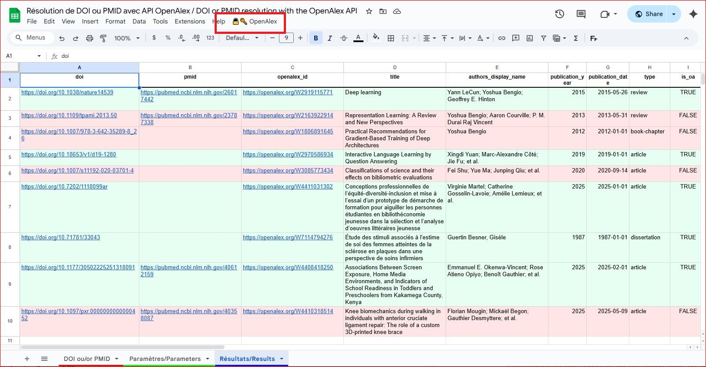

# OpenAlex_DOI_Importation pour Google Sheets / OpenAlex_DOI_Import for Google Sheets

## Version / Version

- Version du script / Script version : **1.0.0**
- Date de la dernière mise à jour / Last update date: **2025-12-15**

## 1. Description de l'outil (English version follows)

Cet outil permet d'interroger l'API OpenAlex à partir d'une liste de DOI et/ou de PMID (Pubmed ID) et d'obtenir un tableau synthétique dans Google Sheets.  
Plus précisément, le script :

- lit les DOI et PMID saisis dans l'onglet `DOI_ou/or_PMID` ;
- envoie des requêtes à l'API [https://api.openalex.org/works](https://api.openalex.org/works) avec des filtres optionnels (années, type de document, accès ouvert, include_xpac) configurés dans l'onglet `Paramètres/Parameters` ;
- récupère, pour chaque DOI/PMID trouvé, des métadonnées de base (titre, année, type, auteurs) et des informations de libre accès basées sur `best_oa_location` (source, type, licence, version, URL OA) et `open_access` (is_oa, oa_status) ;
- écrit les résultats normalisés dans l'onglet `Résultats/Results`, avec une mise en couleur simple (par exemple vert pâle pour les travaux en libre accès).

Dans OpenAlex, `best_oa_location` représente le meilleur point d'accès libre à l'article (en général l'URL la plus stable et utile pour un texte intégral en libre accès, quand disponible).

L'outil est pensé comme un gabarit réutilisable pour des chercheurs, bibliothécaires ou analystes souhaitant extraire rapidement des informations relatives au libre accès d'OpenAlex à partir d'une liste de DOI, sans installer Python, R ou d'autres langages sur leur poste.

---

## 2. Lien vers la feuille modèle

La feuille Google Sheets modèle (lecture seule) se trouve à l'adresse suivante :

> **Modèle Google Sheets / Google Sheets template**  
> [https://docs.google.com/spreadsheets/d/1Bmvp-egLfwjA9VFR6YFeou5fW6C8Z4nQtnjFGQ7_1AM/edit?usp=sharing](https://docs.google.com/spreadsheets/d/1Bmvp-egLfwjA9VFR6YFeou5fW6C8Z4nQtnjFGQ7_1AM/edit?usp=sharing)

---

## 3. Prérequis

- Disposer d'un **compte Google** (institutionnel ou personnel).  
- Avoir accès à **Google Sheets**.  
- Accepter les **autorisations d'exécution** Apps Script lors du premier lancement.

### Autorisations d'exécution Google Apps Script

Lors de la première utilisation du menu OpenAlex dans VOTRE copie de la feuille :

1. Google affichera un message indiquant que ce script souhaite s'exécuter sous votre compte.
2. Il faudra :
   - sélectionner votre compte Google ;
   - lire l'écran d'avertissement (parfois du type "Cette application n'a pas été vérifiée...") ;
   - cliquer sur "Avancé" puis "Continuer" si vous faites confiance au script ;
   - accorder les autorisations suivantes, entre autres :
     - accès à la feuille de calcul (lecture/écriture) pour pouvoir lire les DOI et écrire les résultats ;
     - accès à Internet (via `UrlFetch`) pour interroger l'API OpenAlex.
3. Une fois ces autorisations accordées, le script pourra être relancé sans redemander ces permissions, sauf modification importante ou changement de compte.

---

## 4. Comment utiliser le modèle

### 4.1 Créer votre propre copie

1. Ouvrir le modèle à partir du lien : [https://docs.google.com/spreadsheets/d/1Bmvp-egLfwjA9VFR6YFeou5fW6C8Z4nQtnjFGQ7_1AM/edit?usp=sharing](https://docs.google.com/spreadsheets/d/1Bmvp-egLfwjA9VFR6YFeou5fW6C8Z4nQtnjFGQ7_1AM/edit?usp=sharing).  
2. Dans le menu Google Sheets, cliquer sur **Fichier → Créer une copie...**.  
3. Enregistrer la copie dans votre propre Google Drive.  
4. C'est cette copie qui servira à vos propres requêtes et que vous pourrez modifier librement.

### 4.2 Renseigner les DOI/PMID

1. Aller dans l'onglet **`DOI_ou/or_PMID`**.  
2. Éditer uniquement la colonne A.  
3. Saisir la liste de DOI/PMID à partir de la cellule `A2` (une ligne par DOI/PMID).  
4. Ne pas ajouter de guillemets ni d'espaces inutiles.

### 4.3 Configurer les paramètres

1. Aller dans l'onglet **`Paramètres/Parameters`**.  
2. Éditer uniquement la colonne B en suivant les consignes de la colonne A, par exemple :
   - `mailto` : votre adresse courriel (recommandé vis à vis d'OpenAlex et pour la gestion de charge, "polite pool") ;
   - `year_min` / `year_max` : années de publication minimale et maximale (format `AAAA`, optionnel) ;
   - `type` : type de document (par exemple `article`, `review`, `dataset`, `book`, etc., optionnel) ;
   - `only_oa` : `TRUE` ou `VRAI` pour ne garder que les travaux en libre accès (laisser vide, ou FAUX/FALSE, pour ne pas filtrer) ;
   - `include_xpac` : `TRUE` ou `VRAI` pour inclure le pack d'extension xpac (DataCite complet et de nombreux dépôts), laisser vide (ou FAUX/FALSE) sinon.

Important : La valeur `mailto` doit être renseignée avec votre courriel

### 4.4 Lancer le script et récupérer les résultats

1. Dans la barre de menu de la feuille, choisir **`🔓🔑 OpenAlex → >> Mettre à jour / Update (OpenAlex)`**.  
2. Lors du premier lancement dans VOTRE copie, Google demandera d'autoriser le script (voir section Autorisations ci-dessus).  
3. Le script :
   - lit les DOI/PMID depuis l'onglet `DOI_ou/or_PMID` ;
   - applique les paramètres de l'onglet `Paramètres/Parameters` ;
   - interroge l'API OpenAlex en blocs de 50 DOI/PMID ;
   - écrit les résultats dans l'onglet `Résultats/Results` :
     - une ligne par travail trouvé ;
     - colonnes incluant DOI, PMID, id OpenAlex, titre, auteurs, année, type, informations de libre accès (is_oa, oa_status, best_oa_location, etc.) ;
     - fond vert pâle pour les lignes correspondant à des travaux en libre accès (only_oa = TRUE/VRAI), et rouge pâle pour les autres.

L'ordre des lignes dans la feuille `Résultats/Results` reflète l'ordre renvoyé par l'API OpenAlex, qui peut différer de l'ordre initial des DOI/PMID dans la feuille `DOI_ou/or_PMID`, et le script ne réordonne pas ces résultats.

Vous pouvez ensuite trier, filtrer, copier ou exporter les résultats (CSV, Excel, etc.) depuis Google Sheets.

---

## 5. Licence

Le script est distribué sous licence **GPL (GNU General Public License), version 3**.  
En pratique, cela signifie notamment :

- vous pouvez utiliser, étudier, modifier et redistribuer le script ;
- toute redistribution d'une version modifiée doit rester sous GPL v3 (copyleft) ;
- il est recommandé de conserver l'en-tête de licence dans le fichier de script et de joindre un fichier `LICENSE` (texte de la GPL v3) dans tout dépôt public (par exemple sur GitHub).

---

## 6. Historique des versions

- **1.0.0 (2025-12-15)**  
  Première publication publique du script (import de DOI & PMID, filtres de base, couleurs OA, best_oa_location, include_xpac).

---
---

## 1. Tool description

This tool allows you to query the OpenAlex API from a list of DOIs/PMIDs and obtain a concise table in Google Sheets.  
More specifically, the script:

- reads the DOIs entered in the `DOI_ou/or_PMID` sheet;
- sends requests to the [https://api.openalex.org/works](https://api.openalex.org/works) API with optional filters (years, document type, open access, include_xpac) configured in the `Paramètres/Parameters` sheet;
- retrieves, for each DOI/PMID found, basic metadata (title, year, type, authors) and open access information based on `best_oa_location` (source, type, license, version, OA URL) and `open_access` (is_oa, oa_status);
- writes normalized results into the `Résultats/Results` sheet, with simple color coding (for example light green for open access works).

In OpenAlex, `best_oa_location` represents the best open access entry point for the article (generally the most stable and useful URL to an open full text, when available).

The tool is designed as a reusable template for researchers, librarians or analysts who wish to quickly extract OpenAlex open access information from a list of DOIs/PMIDs, without installing Python, R or other languages on their own machine.

---

## 2. Link to the template sheet

The read-only Google Sheets template is available at:

> **Google Sheets template**  
> [https://docs.google.com/spreadsheets/d/1Bmvp-egLfwjA9VFR6YFeou5fW6C8Z4nQtnjFGQ7_1AM/edit?usp=sharing](https://docs.google.com/spreadsheets/d/1Bmvp-egLfwjA9VFR6YFeou5fW6C8Z4nQtnjFGQ7_1AM/edit?usp=sharing)

---

## 3. Requirements

- A valid **Google account** (institutional or personal).  
- Access to **Google Sheets**.  
- Acceptance of **Google Apps Script execution permissions** on first run.

### Google Apps Script authorization

On the first use of the OpenAlex menu in YOUR copy of the sheet:

1. Google will display a message indicating that this script wants to run under your account.
2. You will need to:
   - select your Google account;
   - read the warning screen (often something like "This app has not been verified...");
   - click "Advanced" then "Continue" if you trust the script;
   - grant the following permissions, among others:
     - access to the spreadsheet (read/write) so it can read DOIs and write results;
     - access to the Internet (via `UrlFetch`) so it can query the OpenAlex API.
3. Once these permissions are granted, the script can be run again without asking for them, unless there is a significant modification or you switch accounts.

---

## 4. How to use the template

### 4.1 Create your own copy

1. Open the template using the link: [https://docs.google.com/spreadsheets/d/1Bmvp-egLfwjA9VFR6YFeou5fW6C8Z4nQtnjFGQ7_1AM/edit?usp=sharing](https://docs.google.com/spreadsheets/d/1Bmvp-egLfwjA9VFR6YFeou5fW6C8Z4nQtnjFGQ7_1AM/edit?usp=sharing).  
2. In the Google Sheets menu, click **File → Make a copy...**.  
3. Save the copy in your own Google Drive.  
4. This copy is the one you will use for your own queries and that you can freely modify.

### 4.2 Enter the DOIs/PMIDs

1. Go to the **`DOI_ou/or_PMID`** sheet.  
2. Edit **column A only**.  
3. Enter the list of DOIs/PMIDs starting from cell `A2` (one DOI or PMID per line).  
4. Do not add quotes or unnecessary spaces.

### 4.3 Configure the parameters

1. Go to the **`Paramètres/Parameters`** sheet.  
2. Edit **column B only**, following the instructions in column A, for example:
   - `mailto`: your email address (recommended for OpenAlex "polite pool" and load management);
   - `year_min` / `year_max`: minimum and maximum publication years (format `YYYY`, optional);
   - `type`: document type (for example `article`, `review`, `dataset`, `book`, etc., optional);
   - `only_oa`: `TRUE` or `VRAI` to keep only open access works (leave blank, or set to FALSE, to disable this filter);
   - `include_xpac`: `TRUE` or `VRAI` to include the xpac extension pack (full DataCite corpus and many repositories), leave blank (or set to FALSE) otherwise.

Important : `mailto` value must be filled with your email address.

### 4.4 Run the script and retrieve the results

1. In the sheet menu bar, select **`🔓🔑 OpenAlex → >> Mettre à jour / Update (OpenAlex)`**.  
2. On first run in YOUR copy, Google will ask you to authorize the script (see the Authorization section above).  
3. The script will:
   - read the DOIs/PMIDs from the `DOI_ou/or_PMID` sheet;
   - apply the parameters from the `Paramètres/Parameters` sheet;
   - query the OpenAlex API in batches of up to 50 DOIs;
   - write the results into the `Résultats/Results` sheet:
     - one row per work found;
     - columns including DOI, PMID,OpenAlex id, title, authors, year, type, and open access information (is_oa, oa_status, best_oa_location, etc.);
     - light green background for rows corresponding to open access works (only_oa = TRUE/VRAI), and light red for the others.

The row order in the `Résultats/Results` sheet follows the order returned by the OpenAlex API, which may differ from the initial DOI order in the `DOI` sheet, and the script does not reorder these results.

You can then sort, filter, copy or export the results (CSV, Excel, etc.) from Google Sheets.

---

## 5. License

This script is released under the **GPL (GNU General Public License), version 3**.  
In practice, this means:

- you may use, study, modify and redistribute the script;
- any redistributed modified version must remain under GPL v3 (copyleft);
- it is recommended to keep the license header in the script file and to include a `LICENSE` file (GPL v3 text) in any public repository (for example on GitHub).

---

## 6. Version history

1.0.0 (2025-12-15)
First public release of the script (DOI & PMID import, basic filters, OA color coding, best_oa_location, include_xpac).